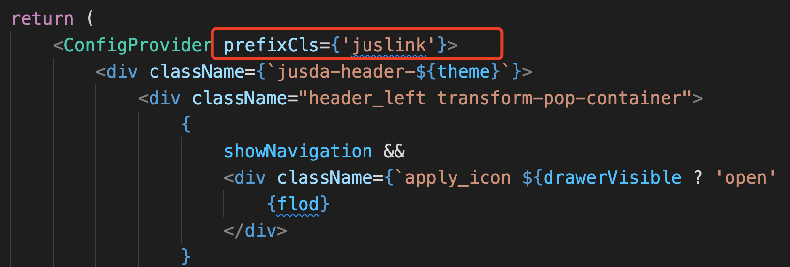
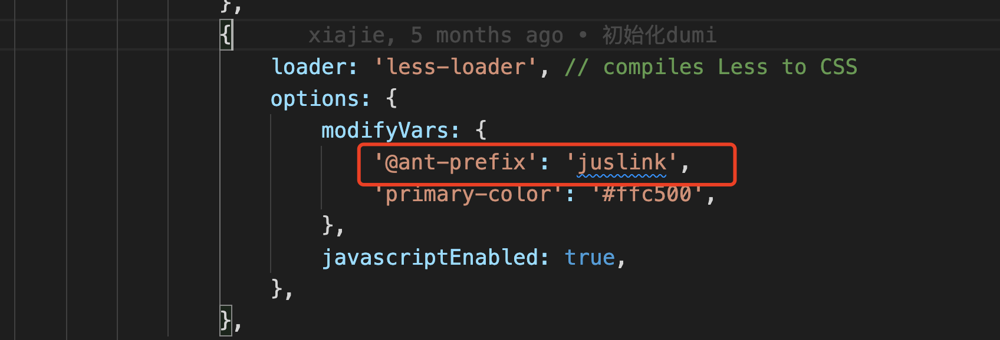
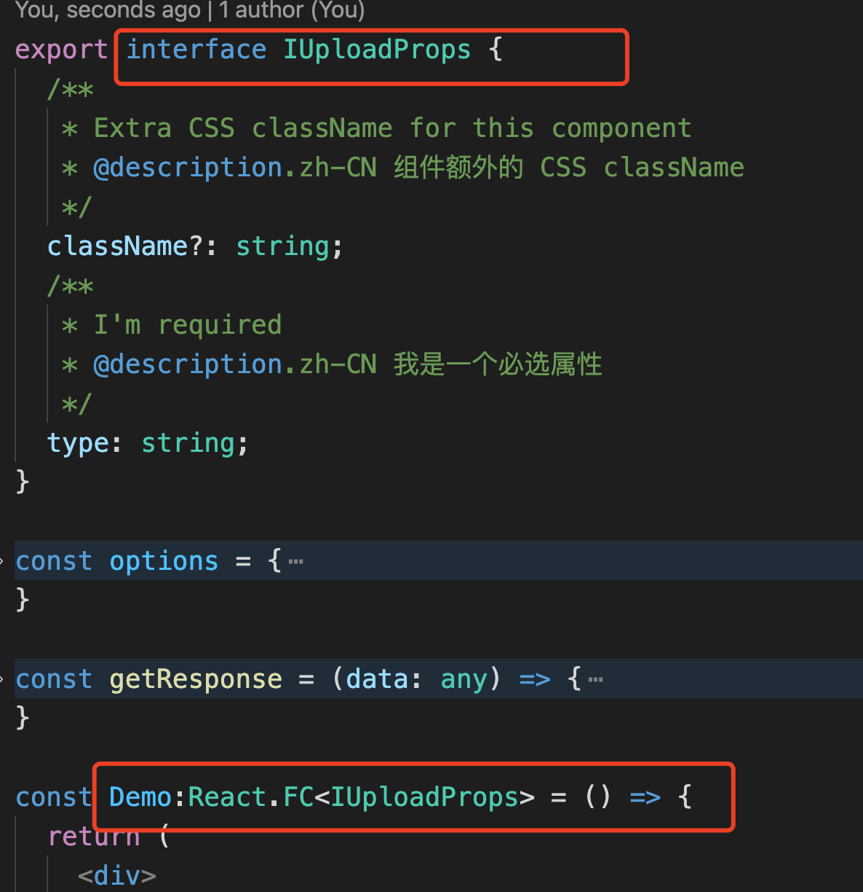
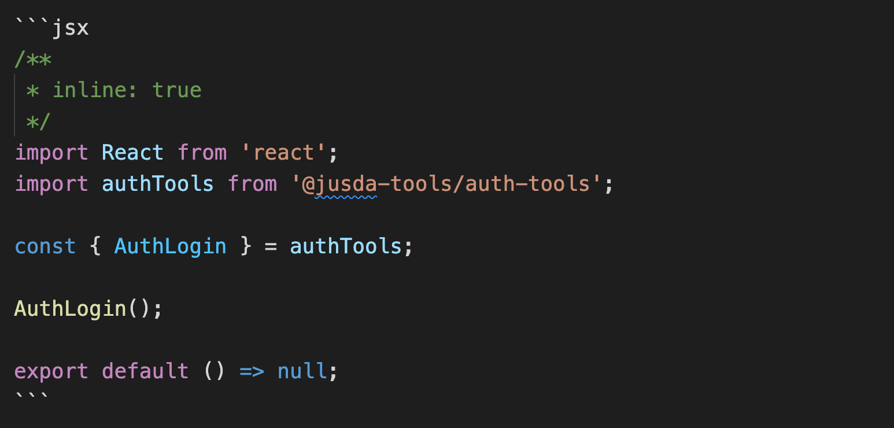
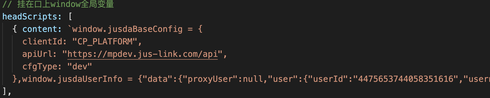

## 代码迁移

由于dumi是新建的代码仓库，packages目录下并非最新组件，需要对packages目录下组件更新

+ 当前packages内组件与原项目内组件目录进行覆盖即可

+ 覆盖完成后需要<b>修改各个组件内package.json文件配置</b>：```"sideEffects":true```

+ 同时需要<b>修改antd组件库前缀，统一修改为juslink</b>，例如：
  

## 组件开发流程

+ 开发流程更加简洁明了，在package目录下新建项目或修改后，保存即会出发dumi热更新，引入demo可实时预览，写法参考```指南```部分

+ 建议publish之前，使用npm link到实际项目测试无误后提交，以防万一

## 组件文档编写规范

+ 组件文档统一化管理，目录位于``` /docs/doc/ ```内

+ 组件文档内demo与API统一管理， 目录位于``` /demo/xxx/ ```内，demo与API可写在同一个文件内，例如：


+ 关于API编写格式，参照开源库 ``` react-docgen-typescript ```, [参考文档](https://github.com/styleguidist/react-docgen-typescript#example)。

## 特殊场景应用

因为部分组件与业务系统强关联，需要使用部分业务系统数据，针对该情况，dumi目前有两种解决方法

+ 使用dumi的``` FrontMatter ```属性 ``` inline: true ```,直接将数据嵌入文档，例如：


+ 全局定义参数，可在根目录下``` .umirc.ts ```文件内使用``` define: {foo: 'bar'} ```方法定义全局参赛

+ 需要挂载到window变量的，可在根目录下``` .umirc.ts ```文件内使用``` headScripts ```添加，写法[参照dumi配置文档](https://d.umijs.org/zh-CN/config#headscripts), 引入了两个配置，有修改需求覆盖即可

