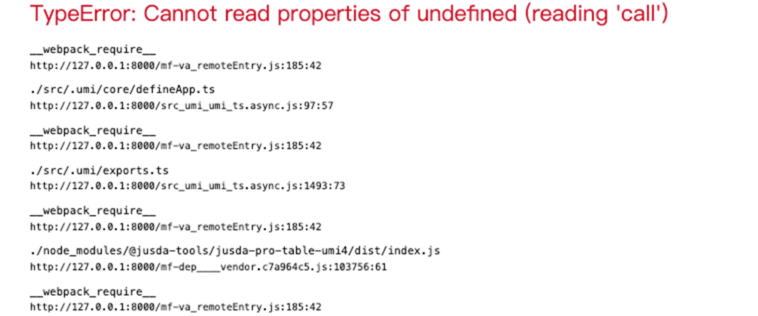

<!-- 提取MD -->
# jusda-pro-table
## pro-table的columnsState的值将会存储在localstorage中proTableConfig中(key的命名规则是 clientId - cfgType - pathname - customizeKey（一定要区分环境）)

## API
| 名称 |                  描述                  |    类型    |                   可选值                   |  默认值  |                               示例                                |
| :-----------: |:------------------------------------:|:--------:|:---------------------------------------:|:-----:|:---------------------------------------------------------------:|
| resizable |    表格表头宽度是否可以拖动（列的宽度必须是number类型）     | boolean  |               true/false                | false |                                -                                |
| customizeKey | 自定义key（当一个页面中有两个及以上proTable时，需要手动传入） |  string  |                    -                    |   -   |                                -                                |
| propColumnsStateValue |         自定义ColumnsStateValue         |  string  |                    -                    |   -   |               {title : {order: 2, disable: true}}               |
| isExportExcel |                开启导出功能                | boolean  |               true/false                | false |                                -                                |
| exportConfig |               导出功能具体配置               |  object  |                    -                    |   -   |                    参考demo或者fore-end-export组件                    |
| metadataSwitch |             开启自动调用元数据功能              | boolean  |               true/false                | false |                    参考demo或者fore-end-export组件                    |
| functionCode |              元数据的功能code              |  string  |                    -                    |   -   |                          必填，具体值请在元数据查看                          |
| onMasterDataChange |               元数据更新事件                | function | (masterColumnsData, contextValue) => {} |   -   | 元数据更新事件。 masterColumnsData是元数据返回的列信息,contextValue是元数据的context对象 |
<!-- end提取MD -->

## Example

```jsx
import React, {useEffect, useLayoutEffect, useRef, useState} from 'react';
import {ProTable} from '@jusda-tools/jusda-pro-table-umi4';
import request from '@jusda-tools/web-api-client';
import {Form, Button, Input} from 'antd';
// import "@ant-design/pro-table/dist/table.css";

const columns = [
    // {
    //   dataIndex: 'index',
    //   valueType: 'indexBorder',
    //   width: 48,
    // },
    {
        title: 'name',
        exportColumnName:"999999999999999999",
        dataIndex: 'name',
        copyable: true,
        ellipsis: true,
        width: 30,
        tip: '标题过长会自动收缩',
        formItemProps: {
            rules: [
                {
                    required: true,
                    message: '此项为必填项',
                },
            ],
        },
    },
    {
        title: 'iso3Code',
        width: 50,
        dataIndex: 'iso3Code',
        sorter: true,
    },
    {
        title: 'iso2Code',
        ellipsis: true,
        key: 'iso2Code',
        render: (value, record) => {
            return (
                <div>
                    ddd
                </div>
            );
        },
        defaultSortOrder: 'ascend',
        sorter: true,
    },
    {
        title: 'mobileArea',
        ellipsis: true,
        key: 'mobileArea',
    },
    {
        title: '创建者',
        width: 50,
        dataIndex: 'creator',
        valueEnum: {
            all: {text: '全部'},
            付小小: {text: '付小小'},
            曲丽丽: {text: '曲丽丽'},
            林东东: {text: '林东东'},
            陈帅帅: {text: '陈帅帅'},
            兼某某: {text: '兼某某'},
        },
    },
    // {
    //   disable: true,
    //   title: '状态',
    //   dataIndex: 'state',
    //   filters: true,
    //   onFilter: true,
    //   ellipsis: true,
    //   valueType: 'select',
    //   valueEnum: {
    //     all: { text: '超长'.repeat(50) },
    //     open: {
    //       text: '未解决',
    //       status: 'Error',
    //     },
    //     closed: {
    //       text: '已解决',
    //       status: 'Success',
    //       disabled: true,
    //     },
    //     processing: {
    //       text: '解决中',
    //       status: 'Processing',
    //     },
    //   },
    // }
];

const searchFn = async (page, size) => {
    request.interceptors.request.use(
        (url, options) => {
            // @ts-ignore
            const {headers} = options;
            return {
                url: /http/.test(url) ? url : `${mpApiUrl}${url}`,
                options: {
                    ...options, headers: {...headers},
                },
            };
        },
        {global: false}
    );
    const res = await request.post(`https://mpdev.jus-link.com/api/master-data-management/countries/page?page=${page || 0}&size=${size || 10}`, {data: {}});
    return {
        total: res.data.totalElements,
        page: res.data.number,
        data: res.data.content,
    }
}

function Test() {
    const tableRef = useRef();
    const [column, setColumn] = useState(columns);
  
    return (<div>
        <ProTable
            metadataSwitch={true}
            functionCode={'PO_ITEM_LIST'}
            columns={column}
            ref={tableRef}
            columnEmptyText={false}
            search={false}
            onMasterDataChange={(data) => {console.log('11', data)}}
            // bordered
            options={{
                reload: false,
                density: false,
            }}
            toolBarRender={() => {
                return <span onClick={() => tableRef?.current?.handleExport()}>111</span>
            }}
            className="user-table"
            dataSource={[]}
            pagination={false}
            size="small"
            resizable={true}
            isExportExcel={true}
            exportConfig={{
                fileName: '4pl导出文件',
                // expandColumns: [],
                valueFormat: {
                    'xx': {
                        'yes': '是',
                        'no': '否',
                    }
                },
                searchFn: searchFn,
            }}
        />
    </div>)
}

export default Test;
```

### 注意事项
1. dataIndex和key同时存在，需保持一致，否则保存列会失效

例：场景：dataIndex是render使用的值，key为排序参数传给后端的。
  
修改前
 ```
  {
      title: '时间',
      dataIndex: ['poCreateDate','utcDate'],
      key: 'poCreateDate.utcDate',
      width: 120,
      render: data => <Placeholder value={data} />,
  },
 ```
 修改后：
 ```
   {
      title: '时间',
      key: 'poCreateDate.utcDate',
      width: 120,
      render: (_, record) => <Placeholder value={record?.poCreateDate?.utcDate} />,
  },
 ```
2. 使用ellipsis属性，render的第一参数返回为node，第二参数为当前行的数据，使用render自定义渲染的需注意

  例：场景：数量需要千位符

  修改前
  ```
  {
      title: '数量',
      dataIndex: 'totalShipmentQty',
      render: num => (
            <Statistic value={num} precision={0} />
      ),
  },
  ```

  修改后
   ```
  {
      title: '数量',
      dataIndex: 'totalShipmentQty',
      ellipsis: true,
      render: (__,record) => (
            <Statistic value={record?.totalShipmentQty} precision={0} />
      ),
  },
  ```

3. 使用sortOrder管控table的排序，如果没有用useState管控column，会造成点击排序后排序了但是排序按钮无变化
 
 例：场景：sorted为外部排序参数，sortOrder被管控
 ```
 const column = (sorted:any) => {
  return [
    {
      title: 'ASN号',
      dataIndex: 'asnNo',
      key: 'asnNo',
      sorter: true,
      sortOrder: sorted.columnKey === 'asnNo' && sorted.order,
    },
  ]
 }
 ```
 解决方案：
 1. 不写sortOrder。由table自行管控，则初进页面排序按钮不会点亮
 2. 使用useState管控column。setState后触发pro-table的重新渲染。

 注：以下代码只是demo
 ```
 const columnConfig = [
    {
      title: 'ASN号',
      dataIndex: 'asnNo',
      key: 'asnNo',
      sorter: true,
      sortOrder: sorted.columnKey === 'asnNo' && sorted.order,
    },
  ]
const [column, setColumn] = useState(columnConfig)
const tableChange = ()=>{
  setColumn(columnConfig)
}
    <ProTable
        columns={column}
        columnEmptyText={false}
        dataSource={[{ status: 'Default', title: '22'  }]}
        search={false}
        rowKey="userId"
        propColumnsStateValue={
            {title : {order: 2, disable: true}}
        }
        options={{
            reload: false,
            density: false,
        }}
        onChange={tableChange}
        size="small"
    />
 ```
### 常见问题
1. TypeError: Cannot read properties of undefned (reading 'call') 下面附带一堆看不懂的


  原因：打包方式问题

  解决方案：在config/config.js中添加下面代码，并重启
```
    mfsu: false,
    jsMinifier: 'terser',
```

## 更新日志
### V0.0.7 
新增size参数，行高默认为默认
## v0.0.9
proTableConfig的命名规则中，pathName的值从history获取变成了从useRouteMatch()上获取，兼容路由上存在动态参数的业务场景(/a/b/:id) 

## v0.0.10
打包排除umi依赖

## v0.0.11
打包排除umi依赖

## v0.0.13
处理国际化在项目中不执行的问题，(在dumi中是正常的)

## v0.0.19
pro-table组件接入fore-end-export组件，使用isExportExcel参数可以打开前端导出功能，exportConfig具体参数请参考fore-end-export组件中的exportProtable方法。

## v0.0.19
pro-table组件接入元数据，使用metadataSwitch参数可以开启调用元数据功能。
