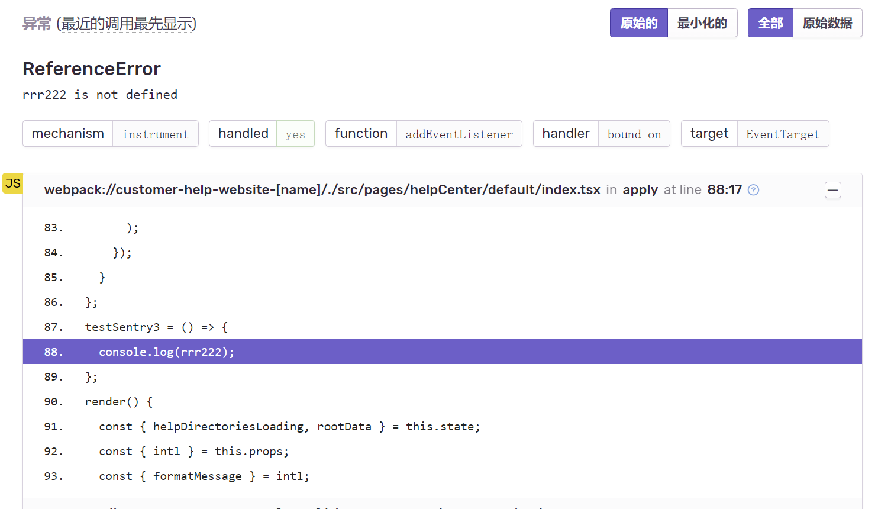

### sentry 集成

## 安装插件
```jsx | pure
npm install @jusda-tools/sentry-tools
```
## 初始化
- public/config配置sentry初始化对象
```jsx | pure
window.jusdaBaseConfig = {
  cfgType: 'dev',
  clientId: 'home',
  apiUrl: 'https://mpdev.jus-link.com/api',
  sentry: {
    dsn:
      'https://37a1fc43a37347808bae5d8815583fb9@sentry-dev.sccpcloud.com/206', // 若dsn需换成内网地址则将sentry-dev.sccpcloud.com替换成 sentry.jusda.int(注：若本地开发替换地址后无法链接sentry，则先用sentry-dev.sccpcloud.com本地测，提代码并准备部署时替换成sentry.jusda.int)
     enable:true, // 若cfgType为dev环境则需添加enable:true或者更改cfgType为非dev环境后才可链接sentry平台
  },
};
```
## 调用sentryInit链接后台
``` jsx |pure
// app.ts引用 @jusda-tools/sentry-tools
import { sentryInit } from '@jusda-tools/sentry-tools';
// 调用sentry
sentryInit();
```

## sourcemap映射
- 安装 @sentry/webpack-plugin
```jsx | pure
npm install @sentry/webpack-plugin
``` 

- 项目根目录下新建并配置sentry.properties
```jsx | pure
defaults.url  # 为sentry的服务器后台地址
defaults.org  # 项目所属组织
defaults.project  # 项目的名称
auth.token # 验证的token，需要保证此token具有以下权限: project:read、project:write、project:releases
```
- 配置webpack | .umirc.ts
```jsx | pure
chainWebpack(memo: any, { env }: any) {
    memo.merge({
      devtool: 'source-map', // sentry,注：map文件
      output: {
        filename: `${packageName}-[name]-[hash].js`,
        sourceMapFilename: `${packageName}-[name]-[hash].js.map`,
      },
      entry: {
        main: path.resolve(ROOT_PATH, './src/app.ts'),
      },
    });
    if (env !== 'development') {
      memo.plugin('sentry').use(SentryCliPlugin, [
        {
          release: 'v.2.5.6', 
          include: './build',
          configFile: 'sentry.properties',
          cleanArtifacts: true,
          urlPrefix: `~/ch/`,
        },
      ]);
    }
  },
```
- 配置TS
``` jsx | pure
{
 "inlineSources": true, 
  "sourceRoot": "/",
  "sourceMap": true,
}
```
 - webpack自动上传sourcemap是无法自动删除map文件，故须在package.json添加删除map文件配置
 ``` jsx | pure
{
     "postbuild": "rimraf ./build/**/*.map"
}
 ```
 ## API

| 参数                 | 说明                   | 类型      | 默认    | 备注 |
| -------------------- | -------------------   | --------- | ------- | ---- |
| dsn                  | 链接地址               | string    | -       |sentry创建项目时得到 |
| release              | 版本                   | string/number| -   | 若上传sourcemap则版本号需在sentry.init与wepack/sentry-cli保持一致     |
| debug               | 调试模式        | boolean   | false    | -    |
| tracesSampleRate     | 捕获错误百分比  | number   | -   |介于 0 和 1 之间的数字，控制给定事务发送到 Sentry 的机会百分比 |
| maxValueLength      | 发送错误长度  | number   | 250   |单个值在被截断之前可以具有的最大字符数（默认为250 |

