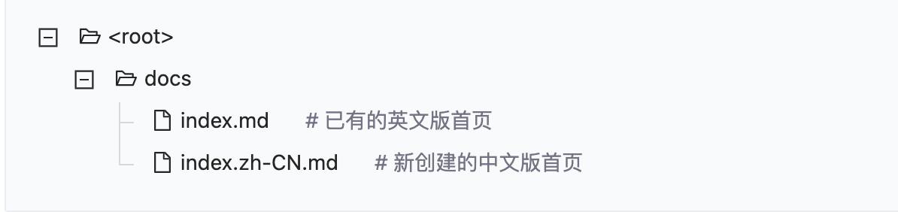

> 详见: [dumi 官网](https://d.umijs.org/zh-CN) 或见 [github/dumi](https://github.com/umijs/dumi) 以及 [lerna 文档](https://github.com/lerna/lerna)

## 设计背景
+ 随着组件库逐渐扩大，日常的组件库管理以及文档管理日益庞大，且无法形成统一化的管理。

+ 当使用组件时会面临不清楚组件的样子以及应用场景，dumi则完美解决这些问题。

+ dumi做到文档统一化管理，组件可即时预览，可在撰写文档的同时渲染出组件以供预览。

+ 由于组件采用lerna做统一管理，恰好dumi完美支持lerna，因此使用dumi+lerna去管理组件库。

## 使用场景
当我们开发组件时，往往伴随着会编写组件使用文档，而普通文档在编辑器中查阅观赏度不高（无法预览组件），而dumi可以做到在md文档中预览组件

## 使用方法

+ 添加dumi外层依赖包
```bash
  $ npm install --registry=http://nexus.jusda.int/verdaccio/
```
+ 使用lerna一键安装packages内各个组件依赖包
```bash
  $ npm install -g lerna;
$ lerna bootstrap;
```
+ 启动项目
```bash
  $ npm run start;
```

## 目录结构

使用 dumi+lerna 做研发的组件库目录结构大致如下：

```markdown
├── docs                // 文档目录
│   └── doc             // 组件文档目录
│   │   ├── .md         // 说明文档或demo文档
│   │   └── .md
│   └──index.md         // 入口md文档
├── packages            // 组件目录
│   ├── compoent1       // 当个组件包
│   ├── compoent2
├── .umirc.ts           // dumi配置文件
├── package.json        // webpack配置文件
————————————————
```

## 自定义导航、分组和标题

如果希望控制导航/分组/页面标题的生成，可以通过**在 Markdown 文件顶部**编写 FrontMatter 实现：

```markdown
---
title: 自定义页面名称
toc: 控制锚点目录的显示或位置，值为 false 时不展示，值为 content 时展示在内容区域的右侧（Affix Menu），值为 menu 时会将当前路由的锚点目录展示在左侧菜单中
nav:
  path: /自定义导航路由
  title: 自定义导航名称
  order: 控制导航顺序，数字越小越靠前，默认以路径长度和字典序排序
group:
  path: /自定义分组路由，注意，分组路由 = 导航路由 + 自己
  title: 自定义分组名称
  order: 控制分组顺序，数字越小越靠前，默认以路径长度和字典序排序
---
```

## 如何写组件 demo
dumi 提供了两种编写 demo 的方式，分别应对不同的场景。
### 在 demo 中引入组件

```jsx
import React from 'react';
import { ImSuspend } from '@jusda-tools/im-component';

export default () => { <ImSuspend defaltPositon={{left: '16px', top: '16px'}} /> };

```
### 引入外部 demo
```jsx|pure
<code src="/path/to/demo.tsx"></code>
```
和代码块 demo 一样，上述代码也会被渲染为 React 组件，并且外部 demo 的源代码及其他依赖的源代码都可以被用户查看，就像这样：

```jsx
/**
 * transform: true
 */
import React from 'react';
import { ImSuspend } from '@jusda-tools/im-component';

export default () => <ImSuspend defaltPositon={{left: '16px', top: '16px'}} />;
```
### 控制 demo 渲染

dumi 提供了一些 FrontMatter 属性，以满足不同的 demo 渲染需求，在**源代码顶部**配置即可：

<pre lang="markdown">
```jsx
/**
 * [配置项名称]: [值]
 */
```
</pre>

对于外部 demo，这些 FrontMatter 属性除了写在源代码里，也可以写在 `code` 标签的属性上：

```html
<code src="/path/to/demo" 配置项="值"></code>
```

dumi 目前支持如下 demo 控制能力，FrontMatter属性详情查看：[FrontMatter](https://d.umijs.org/zh-CN/config/frontmatter#title-1)

### 捕获 `fixed` 元素

设置 `transform` 为 `true`，可使得内部 `position: fixed;` 元素相对于 Demo 包裹器定位：

```jsx
/**
 * transform: true
 * defaultShowCode: true
 */

import React from 'react';

export default () => <h1 style={{ position: 'fixed', top: 0, left: 0 }}>我不会飞出去</h1>;
```

### 修改背景色

通过 `background` 配置项，可以修改它的背景颜色、渐变甚至加上背景图片，dumi 会将其当做 CSS 属性值处理，比如配置 `background` 为 `'#f6f7f9'`：

```jsx
/**
 * background: '#f6f7f9'
 * defaultShowCode: true
 */
/**
 * background: '#f6f7f9'
 */

import React from 'react';

export default () => null;
```

### 不需要内边距

配置 `compact` 为 `true`，则会移除所有内边距：

```jsx
/**
 * compact: true
 * defaultShowCode: true
 */
/**
 * compact: true
 */

import React from 'react';

export default () => '我会贴边站';
```

### 标题与简介

通过 `title` 和 `desc` 配置 demo 的标题和简介：

```jsx
/**
 * title: 我是标题
 * desc: 我是简介，我可以用 `Markdown` 来编写
 * defaultShowCode: true
 */
/**
 * title: 我是标题
 * desc: 我是简介，我可以用 `Markdown` 来编写
 */

import React from 'react';

export default () => null;
```

### 直接嵌入文档

配置 `inline` 为 `true` 则不会展示包裹器、直接在文档里嵌入 demo：

<pre lang="markdown">
```jsx
/**
 * inline: true
 */

import React from 'react';

export default () => '我会被直接嵌入';
```
</pre>

就像这样：

```jsx
/**
 * inline: true
 */

import React from 'react';

export default () => '我会被直接嵌入';
```

### 调试型 demo

设置 `debug` 为 true，则该 demo 仅在开发环境下展示、且会有一个特殊标记：

<!-- ```jsx
/**
 * inline: true
 */
import React from 'react';
import Previewer from 'dumi-theme-default/src/builtins/Previewer';

export default () => (
  <Previewer
    sources={{
      _: {
        jsx:
          "/**\n * debug: true\n */\n\nimport React from 'react';\n\nexport default () => '我仅在开发环境下展示';",
      },
    }}
    dependencies={{}}
    debug
    defaultShowCode
  >
    我仅在开发环境下展示
  </Previewer>
);
``` -->

### iframe 模式

设置 `iframe` 为 `true`，将会使用 `iframe` 渲染 demo，可实现和文档的完全隔离，通常用于布局型组件，此时 [`compact`](/zh-CN/config/frontmatter#compact) 配置默认为 `true`：

```jsx
/**
 * iframe: 150
 * defaultShowCode: true
 */
/**
 * iframe: true // 设置为数值可控制 iframe 高度
 */
import React from 'react';

export default () => (
  <h2 style={{ boxShadow: '0 2px 15px rgba(0,0,0,0.1)', padding: '5px 20px' }}>iframe 模式</h2>
);
```
## 注意事项
> 确保组件package.json文件内，``` "sideEffects": true ```，原因是使用dumi build打包后，组件内样式文件未引入，导致样式丢失

> antd 样式前缀修改统一

> 文档写法规范，严禁直接引用build后生成的文件，正确应用方式应为 ``` import xxx from "xxx" ```， demo统一管理，存放于demo文件夹中


## 使用内置组件

dumi 提供了一系列内置组件作为 Markdown 语法的补充，除了上面我们已经用到过的 `code` 以外，还支持这些：

### Badge

使用 `Badge` 可以创建一个标签：

```markdown
#### 标签测试 <Badge>Hello</Badge>
```

#### 标签测试 <Badge>Hello</Badge>

### embed

dumi 对 HTML 默认的 `embed` 标签做了扩展，可以在一个 Markdown 文档中嵌入另一个 Markdown 文档的内容：

```html
<!-- 引入全量的 Markdown 文件内容 -->
<embed src="/path/to/some.md"></embed>

<!-- 根据行号引入指定行的 Markdown 文件内容 -->
<embed src="/path/to/some.md#L1"></embed>

<!-- 根据行号引入部分 Markdown 文件内容 -->
<embed src="/path/to/some.md#L1-L10"></embed>

<!-- 根据正则引入部分 Markdown 文件内容 -->
<embed src="/path/to/some.md#RE-/^[^\r\n]+/"></embed>
```

## 组件 API 自动生成

现在，我们可以通过 JS Doc 注解 + TypeScript 类型定义的方式实现组件 API 的自动生成了！

### 组件源码中的类型和注解

组件 API 自动生成的前提是，确保 dumi 能够通过 TypeScript 类型定义 + 注解推导出 API 的内容，例如 `Hello` 组件的源代码：

```tsx | pure
import React from 'react';

export interface IHelloProps {
  /**
   * 可以这样写属性描述
   * @description       也可以显式加上描述名
   * @description.zh-CN 还支持不同的 locale 后缀来实现多语言描述
   * @default           支持定义默认值
   */
  className?: string; // 支持识别 TypeScript 可选类型为非必选属性
}

const Hello: React.FC<IHelloProps> = () => <>Hello World!</>;

export default Hello;
```

dumi 背后的类型解析工具是 `react-docgen-typescript`，更多类型和注解的用法可参考 [它的文档](https://github.com/styleguidist/react-docgen-typescript#example)。

### 在文档中展示 API

有了能够推导 API 的源代码，我们就可以在 Markdown 中通过 `API` 内置组件来渲染 API 表格：

```md
<!-- 不传递 src 将自动探测当前组件，比如 src/Hello/index.md 将会识别 src/Hello/index.tsx -->

<API></API>

<!-- 传递 src 将显式指明渲染哪个组件的 API -->

<API src="/path/to/your/component.tsx"></API>

<!-- src 可使用 alias -->

<API src="@/your/component.tsx"></API>

<!-- 传递 exports 将显式指明渲染哪些导出，请确保值为合法的 JSON 字符串 -->

<API exports='["default", "Other"]'></API>

<!-- 如果不需要 API 相关标题 ，可以使用hideTitle -->

<API hideTitle></API>

```

效果大致如下：

<API hideTitle src="../../demo/recommend/api.tsx"></API>

## 多语言
dumi提供国际化文档方案，默认配置有en以及zh两种配置，使用方式也很简单，en为默认语言，如要配置中文版，在文件后缀前新增zh-CN即可，例如：


dumi会默认加载英文版文档作为页面，如果有其他语言或是多语言需求，可自行到根目录下的 .umirc.ts 目录下配置，例如：

```jsx | pure
// 多语言配置方式如下
navs: {
    'en-US': [
      null,  // null 值代表保留约定式生成的导航，只做增量配置
      { title: 'GitLab', path: 'http://gitlab.jusda.int/jusda-ui/dumi' },  // 自定义导航配置
    ],
    'zh-CN': [
      null,
      { title: 'GitLab', path: 'http://gitlab.jusda.int/jusda-ui/dumi' }, // 自定义导航配置
    ],
  }
// 单语言配置方式如下
  navs: [
    null, // null 值代表保留约定式生成的导航，只做增量配置
    {
      title: 'GitHub',
      path: 'https://github.com/umijs/dumi',
    },
    {
      title: '我有二级导航',
      path: '链接是可选的',
      // 可通过如下形式嵌套二级导航菜单，目前暂不支持更多层级嵌套：
      children: [
        { title: '第一项', path: 'https://d.umijs.org' },
        { title: '第二项', path: '/guide' },
      ],
    },
  ],
```


## 使用lerna发布修改后的组件

  当我们编写完对应包的代码后, 使用 ``` lerna publish ``` 可一键检查发生更改后的组件并做统一发布

```base
$ lerna publish
```

一键将包发布到 npm 上, 此处根据我们选择的管理模式不同，所有 packages 的版本号都会根据lerna.json中的版本号进行更新。但我们需要注意的是 lerna 版本更新支持两种模式:

+ 固定/锁定模式(默认, 指定版本号)

这种模式自动将所有 packages 包版本捆绑在一起，对任何其中一个或者多个 packages 进行重大改动都会导致所有 packages 的版本号进行更新。

+ 独立模式(independent)

独立模式，init的时候需要设置选项--independent。这种模式允许使用者对每个package单独改变版本号。每次执行lerna publish的时候，针对所有有更新的package，会逐个询问需要升级的版本号，基准版本为它自身的package.json里面的版本号。这种情况下，lerna.json的版本号不会变化， 默认为independent。
我们可以在 lerna 初始化时指定:

```base
$ lerna init --independent
```