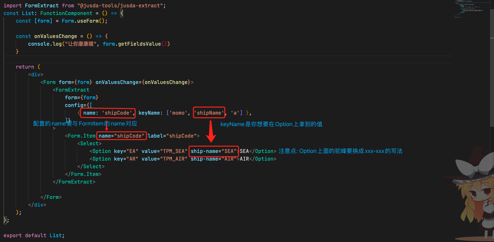

# jusda-extract 表单Select数据提取




## API
| 参数                  | 说明              | 类型       | 默认   | 备注 |
| --------------------- | ----------------- | --------- | -----  | ---- |
| form                  | ant-form表单实例     | FormInterface  |  必填 |  | |
| config                | 需要绑定的formItem配置     | Array    | 必填   | name: string, keyName: string[] |

 <span style="color: #FF4848; font-size: 20px;" >重点康这里:</span>  Option组件的自定义属性的配置规则```<Option ship-name="SEA">SEA</Option>```
 就是你keyName数组里面如果配了有驼峰的属性例如```{keyName: ["shipName"]}``` 那么Option组件请这样写```<Option ship-name="SEA">SEA</Option>```

## 可调用方法 - 渲染自定义组件
```jsx
import FormExtract from '@jusda-tools/jusda-extract';
// Component指你的组件, props 你的传参 没有就不需要 
// 第一种写法
FormExtract.Item(Component, props);
// 第二种写法
FormExtract.Item(<Component name='传你的参数' />);
```


## 介绍
 + 仅支持antd4.0的项目哟
 + 业务背景: 主要是为了解决Form表单中的Select组件的数据提取问题, 因为我们平时的业务Select一般都只能绑定一个值, 有时候我们想要通过Select组件绑定到多个值, 这个时候你可能就会去写onChange事件,然后去做相应的业务逻辑, 该组件就是为了解决这个问题而诞生的.
 + 实质上是为您的form表单添加了若干的<Form.Item noStyle name={keyName数组下的值} >组件, 然后通过Form.Item的shouldUpdate属性去监听字段的变化
 + 目前仅支持获取Select组件下面的Option xxx="xxxx"组件中您定义的keyName的值
 + 获取绑定的数据请使用ant-form表单实例方法 例如: form.getFieldsValue() 查看keyName属性下绑定的值
 + 注意点: 最好避免在Form.Item下添加多余的层级 <b>如果要添加请使用自定义组件形式<b>
 + 例如
``` jsx
<FormExtract
    form={form}
    config={[
        { name: 'shipCode', keyName: ['shipName'] },
    ]}
>
    <Form.Item name="shipCode" label="shipCode">
        <div 不要加什么div或者其他的东西啊啊啊啊 >
            <Select>
                <Option key="EA" value="TPM_SEA" ship-name="SEA">SEA</Option>
                <Option key="AR" value="TPM_AIR" ship-name="AIR">AIR</Option>
            </Select>
        </div>
    </Form.Item>
</FormExtract>
```
## Example

```jsx
import FormExtract from '@jusda-tools/jusda-extract';
const List: FunctionComponent = () => {
    const [form] = Form.useForm();

    return (
        <div>
            <Form form={form} >
                <FormExtract
                    form={form}
                    config={[
                        { name: 'shipCode', keyName: ['shipName'] },
                    ]}
                >
                    <Form.Item name="shipCode" label="shipCode">
                        <Select>
                            <Option key="EA" value="TPM_SEA" ship-name="SEA">SEA</Option>
                            <Option key="AR" value="TPM_AIR" ship-name="AIR">AIR</Option>
                        </Select>
                    </Form.Item>
                </FormExtract>
            </Form>
        </div>
    );
};

export default List;

```

## Example-自定义组件写法

```jsx

// 子组件-函数式写法
const MomoRef = forwardRef((props: any, ref) => {
    const { onChange, value } = props;

    return (
        <div>
            <div>
                <Select ref={ref} onChange={(e) => onChange(e)} value={value} >
                    <Option key="EA" value="TPM_SEA" ship-name="SEA">SEA</Option>
                    <Option key="AR" value="TPM_AIR" ship-name="AIR">AIR</Option>
                </Select>
            </div>
        </div>
    )
});

import FormExtract from '@jusda-tools/jusda-extract';
const List: FunctionComponent = () => {
    const [form] = Form.useForm();

    return (
        <div>
            <Form form={form} >
                <FormExtract
                    form={form}
                    config={[
                        { name: 'shipCode', keyName: ['shipName'] },
                    ]}
                >
                    <Form.Item name="shipCode" label="shipCode">
                        // 你的组件 如果要传参把你需要的参数用对象的形式放进去
                        // 也可以 FormExtract.Item(<Component name='传你的参数' />);
                        {FormExtract.Item(MomoRef, { name: '◉啊哈哈◉' })} 
                    </Form.Item>
                </FormExtract>
            </Form>
        </div>
    );
};


// 子组件-class组件写法
class MomoClassRef extends React.Component {
    ref: any;
    constructor(props: any) {
        super(props);
        this.ref = React.createRef();
    }

    render() {
        return (
            <div>
                <div>
                    //  ref属性必写项哦
                    <Select ref={this.ref} onChange={(e) => this.props.onChange(e)} value={this.props.value} >
                        <Option key="EA" value="TPM_SEA" ship-name="SEA">SEA</Option>
                        <Option key="AR" value="TPM_AIR" ship-name="AIR">AIR</Option>
                    </Select>
                </div>
            </div>
        );
    }
}

import FormExtract from '@jusda-tools/jusda-extract';
const List: FunctionComponent = () => {
    const [form] = Form.useForm();

    return (
        <div>
            <Form form={form} >
                <FormExtract
                    form={form}
                    config={[
                        { name: 'shipCode', keyName: ['shipName'] },
                    ]}
                >
                    <Form.Item name="shipCode" label="shipCode">
                        {FormExtract.Item(MomoClassRef)} // 你的组件
                    </Form.Item>
                </FormExtract>
            </Form>
        </div>
    );
};

export default List;

```
