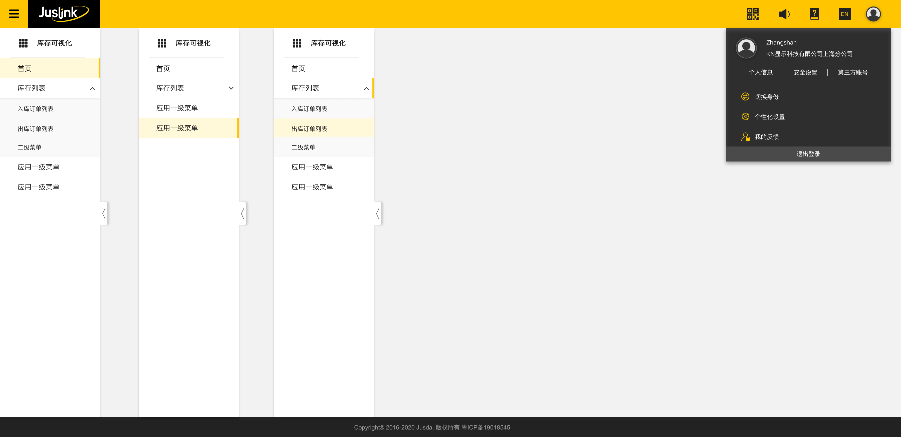

# sider-nav-bar 侧边导航栏



## API
### sider-nav-bar
| 参数    | 说明                   | 类型                                  | 默认  | 备注 |
| ------- | ---------------------- | ------------------------------------- | ----- | ---- |
| name    | 业务名称               | string                                | -     | -    |
| routes  | 导航菜单数据，tree结构 | array<{path, name, [routes, target]}> | []    | -    |
| onClick | 菜单节点点击回调       | function(route)                       | -     | -    |
| theme   | 主题色                 | light \| dark                         | light |      |
| router  | react router           | router                                | -     | -    |
| handlerOnClick  | 箭头图标点击事件           | function                                | -     | -    |
| visible  | Drawer 是否可见           | boolean                                | -     | -    |


### routes

| 参数   | 说明     | 类型                                                         | 默认 | 备注 |
| ------ | -------- | ------------------------------------------------------------ | ---- | ---- |
| path   | 路由路径 | string                                                       | -    | -    |
| name   | 路名名称 | string                                                       | -    | -    |
| routes | 子菜单   | routes[]                                                     | -    | -    |
| authCode | 权限Code   | string                                                    | -    | -    |
| target | 打开方式 | [target](https://developer.mozilla.org/zh-CN/docs/Web/API/Window/open) | -    | -    |

## Example

### 传入路由对象辅助组件实现路由跳转。
```jsx
import React from 'react';
import { history } from 'umi';
import SiderNavBar from '@jusda-tools/sider-nav-bar';

const App: React.FC = () => {
  const props = {
    name: '库存可视化',
    routes: [
      {
        name: '首页',
        path: '/path1',
      },
      {
        name: '库存列表',
        routes: [
          {
            name: '入库1',
            path: '/path31',
          },
        ],
      },
      {
        name: '菜单1',
        path: '/cai',
      },
    ],
    router: history, // 路由对象
  }
  return (
    <div>
      <SiderNavBar {...props} />
    </div>
  );
};

export default App;
```

### 自行处理路由跳转

```jsx
import React from 'react';
import { history } from 'umi';
import SiderNavBar from '@jusda-tools/sider-nav-bar';

const App: React.FC = () => {
  const handleClick = (route) =>{
    history.push(route.path);
  }
  const props = {
    name: '库存可视化',
    routes: [
      {
        name: '首页',
        path: '/path1',
      },
      {
        name: '库存列表',
        routes: [
          {
            name: '入库1',
            path: '/path31',
          },
        ],
      },
      {
        name: '菜单1',
        path: '/cai',
      },
    ],
    onClick: handleClick, // 自行处理
  }
  return (
    <div>
      <SiderNavBar {...props} />
    </div>
  );
};

export default App;
```