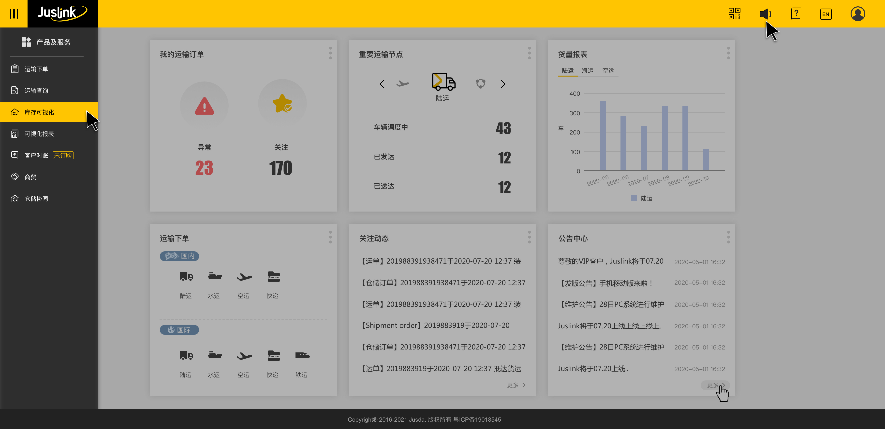

# jusda-header 前端页面头部



## API
### jusda-header
| 参数                  | 说明              | 类型       | 默认   | 备注 |
| --------------------- | ----------------- | --------- | -----  | ---- |
| locale               | 国际化              | string  |  'en-US' |  |      |
| theme                | 主题               | string    | light   | - |
| showNavigation       | 是否展示导航菜单    | boolean    | true  | -    |
| logoReplaceReactNode  | Logo图位置替换元素 | ReactNode  | null | -    |
| leftReactNode        | Header左边元素    | ReactNode  |   |  |      |
| rightReactNode        | Header右边元素    | ReactNode  |   |  |      |
| userIdentitySwitcher        | 用户信息面板配置    | Object  |   |  |      |

## Example

```jsx
import React from 'react';
import TimeConvert from '@jusda-tools/time-convert';

const App: React.FC = () => {
 
  return (
    <div>
      <TimeConvert theme="light" locale="en-US" />
    </div>
  );
};

export default App;
```

#### 更新记录

| 版本号               | 更新内容                        
| ------------------ | --------------------------- 
| 0.0.20        | Logo点击跳转判断是否为内网环境(内网无点击事件)             |
| 0.0.21        | @jusda-tools/user-control-panel 版本升到 0.1.53             |
| 0.0.22        | @jusda-tools/user-control-panel 版本升到 0.1.54             |
| 0.0.26        | @jusda-tools/user-control-panel 版本升到 0.1.57, 用rollup替换了webpack进行了打包, 修改了utils文件中的request中@jusda-tools/web-api-client请求写法, 让其不影响业务系统的请求             |
| 0.0.27        | 引用 user-control-panel 0.1.58版本升级    |
| 0.0.28        | 头部增加工作台跳转按钮   增加 showWorkbench 参数控制显隐(默认为true,如果是内网默认不显示)    |